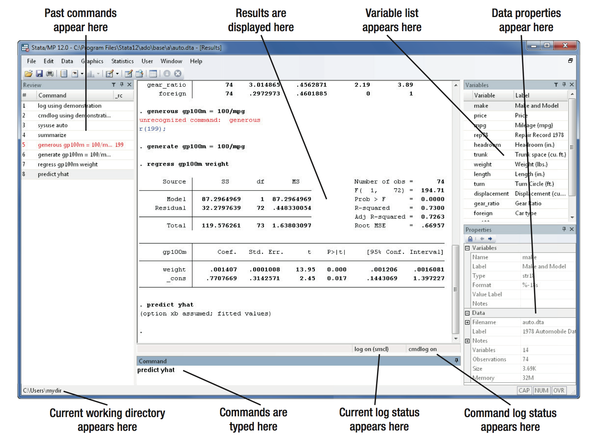
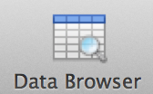
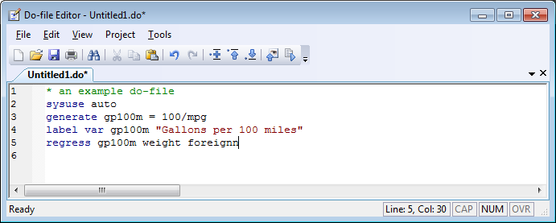

# Recitation 1: Introduction to Stata
McCourt School of Public Policy, Georgetown University

## Key Ideas:
 - Variables vs. Observations
 - File types: `.dta`, `.do`, `.log`
 - Working in do-files / comments

## Variables vs. Observations


- Open Stata by clicking icon


- Open example data set, `auto.dta`, 
  - Type `sysuse auto` in the command panel. `sysuse` is a way to use shipped datasets.
	- Or, using drop-down menus: `File > example data sets > auto.dta`

- Main Stata Window(s):



- Results window: Shows commands entered after a `.` and the resulting output.
- Variables window: Shows variable names and descriptions / labels. 
         Click a variable name to enter it into the command line. 
         Will be empty if no data is loaded.
- Review window: Shows previous commands. Click a previous command to enter it into the command line.
- Command line window: type in commands here and hit 'enter' to execute.
         More on this below.
- Some windows may not appear or are floating on Mac computers in earlier versions of Stata. To show/hide these, use the drop-down menu: `Window> Command/Results/Review/Variables `


### Open browse window 
  * using command line: `browse`
  * using icon (looks like a mini-spreadsheet grid with a little magnifying glass, grid with pencil icon will open the browser in edit mode to change, add, or delete data) or using drop-down menus:
  
  
  * - file > data > data editor > data editor (browse)

* Variables are columns across the top and observations are the rows down the side.

* Browse window:
	- variable window
	- browse a subset of variables using check boxes
	- browse a subset of observations using filter icon


## Basic Commands to Explore the Data Set

* `describe`
* `summarize`
* `list`
* `display`
* `count`

---------------

* `describe`: 
   from drop-down menu: data > describe data > describe data in memory
    - For specified variables (all variables if no specific variables specified in command), lists name, description, variable type (storage type-- byte, int, and float are numeric; anything starting with `str` is a string variable), display format (how many digits before decimals are rounded), and label. 
    - If run for all variables, also lists the number of observations, number of variables, and information about the data file.

* `summarize`: 
    from drop-down menu: data > describe data > summary statistics
  -For specified variables dislplays variable name, # of observations, 
       mean, standard deviation, minimum value, and maximum value.

* `list`: from drop-down menu: data > describe data > list data
   - Displays the value of specified variables (or all if none specifically selected) for each observation meeting conditions specified in `if` box.

* For `describe,` `summarize,` and `list` you can specify one or more variables to run the command on by listing their names in the variables line separated by a space ` `, rather than running the command for all variables by leaving the line blank.
This is espeically useful for extremely large data sets where seeing all variables would be cumbersome

* `display`: from drop-down menu: `data > other utilities > hand calculator`
  - Performs basic athrimatic calcluations. Can use standard operators: 
     `+`, `-`, `*` (multiplication), `/` (division), `^` (exponent/power). Expressions follow order of operations and can use  parentheses `()` to emphasize specific order of operations.

* `count`: from drop-down menu: `data > data utilities > count` observations satisfying condition
   - Counts the number of observations satisfying specified conditions in `if` box. (if no conditions specified, the command counts the total number of observations in your dataset).


## Drop-down menus vs. command line
 
 - Every command issued through the drop-down menu can also be issued as
	a typed command.
 
 - Commands show up in the results window, in bold after a `.` 
      and previous commands are recorded in the review window.
 
 - To issue commands type its name or a shortened version/abbreviation into the 
     command line window and hit enter.
       -`describe` or `des` 
       -`summarize` or `sum` 
       -`list` or `li`
       -`count` or `cou`
       -`display` or `di`

     - To issue the command for one or a subset of variables, list the name of each variable
         after the command separated by a space
- For example type `sum mpg price` and hit enter to summarize only the mpg and price variables.
   

 - Note that:
	- commands and variable names are case sensitive
	- tab-completion of variable names
	- variables can be entered by clicking in variable window
	- Page-up cycles through old commands


## Wroking in a do-file

* Replication is particularly important in studies that can impact broad policy
* Specificlly, data and computer code (i.e. do-file) should be available.

### Do-file editor
* Start by clicking the Do-file Editor button, or by typing `doedit` in the command window and pressing Enter.
* Do-file editor has syntax highlighting function. Try copying the following code to a code editor:

```
* An example do-file
sysuse auto
gen gp100=100/mpg
label var gp100m "Gallons per 100 miles"
reg gp100m weight foreignn
```



* Execute codes by clicking on the `Do` button. What's wrong? Try clicking the `Do` button again and see result.
* Correct codes and click the `Do` button again

Always work in a do-file because:
  - Professors will require it
  - Helps you stay organized
  - Helps you recover from mistakes
        - Is a way of saving your work
  - Saves you typing

 Comments can help you stay organized
  - Comments are text in your do-file that are not executed by Stata.
  - Comment lines begin with `*`
        - Comment sections (multiple lines) begin with `/*` and end with `*/`

## Running commands on a subset of observations


* Commands with `if,` `by,` and/or `in` (the summarize, count, and list commands so far) can also be run on a SUBSET of OBSERVATIONS that meet the conditions in the `if` section or after `if` in a statement in the command line.

- Specify a subset of observations whose values meet conditions by using the relational operators below to specify the conditions that the value of variable(s) for each observation must meet to be included in calculation.

         >   greater than
         <   less than
         >=  > or equal
         <=  < or equal
         ==  equal
         !=  not equal
         ~=  not equal

A double equal sign `==` is used for equality testing. A single equal sign will be used to assign a variable a value. We'll see more on this in future classes.

### Example
- For example to summarize the price and weight variables for only observations with mpg greater than 20:
    Type `summarize price weight if mpg > 20` and hit enter. 
Notice that there are fewer observations included.

-To specify multiple conditions for a command, use the logical operators `&` for AND (must meet both condition) and `|` (shift+\) for OR (must meet either one of the conditions).

- For example to summarize the price and weight variables for only observations with mpg greater than 20 AND that are foreign:

Type `summarize price weight if mpg > 20 & foreign == 1` and hit enter. 

- Example 2, to summarize the price and weight variables for only observations that EITHER have mpg greater than 20 OR that are foreign:

Type `summarize price weight if mpg > 20 | foreign == 1` and hit enter.

##  In-Class Activity 1
Open the `auto.dta` data set and issue the `describe` and `summarize` commands from above. 

Try to answer the questions below.

Questions using the auto.dta example dataset: 
 1. describe all variables 
 2. summarize price mpg weight and length  
 3. What is the difference between the highest and lowest mpg?
 4. Summarize price, mpg, weight, and length for cars costing less than $4,000
 5. List the make and price of the most expensive car


### Result should be something like this:
```
sysuse auto.dta

* 1. describe all variables 
describe

* 2. summarize price mpg weight and length 
summarize price mpg weight length

* 3. What is the difference between the highest and lowest mpg?
display 41-12
* Difference between highest and lowest mpg is 29.

* 4. Summarize price, mpg, weight, and length for cars costing less than $4,000
summarize price mpg weight length if price < 4000

* 5. List the make and price of the most expensive car
list make price if price == 15906
```

## Stata File Types


- `.DTA`
 You've already encountered the Stata dataset, `.dta` file type.

- `.DO`
Do-file: holds a list of commands that are executed as if you typed them into the command line one-by-one, .do file type.

- `.LOG` 
 Log files copy everything that is printed in the results window. 
 There are several reasons why you might want to use a log file:
 	- you want a record of commands and output from a Stata session
	- your instructor may request a `.log` file to be submitted 

(More next week)

## After-Class Exercises using the `lifeexp.dta` example dataset:

Create a do-file to open the lifeexp.dta example data set 
   (File>Example Data Sets> Example datasets installed with Stata Then Click 'use' to the right of lifeexp.dta 
   Be sure to clear any data you have in memory first by typing `clear` in the command line and hitting enter)

Try to answer the questions below.
Include at least one comment documenting the question you are answering
and your answer to the question, if necessary

Practice various methods for running the do-file.

When the do-file is complete, start a log using the drop-down menu.
Run the do-file once to record output.
Close the log.
For problem sets, students should submit do-file and log.

-----------------

1. How many variables are there? How many variables are string vs. numeric variables?
2. How many observations are there? 
3. Are any variables missing data for observations? 
   If so, what are they and how many observations have missing data for each?
4. What is the difference between the country with the greatest and least life expectancy?

## Getting Started Guides

- For anyone who wants to get ahead or as a resource in the future

- Dropdown menu
	Help > PDF Documentation
	Show Getting Started Guide for Windows and Mac


