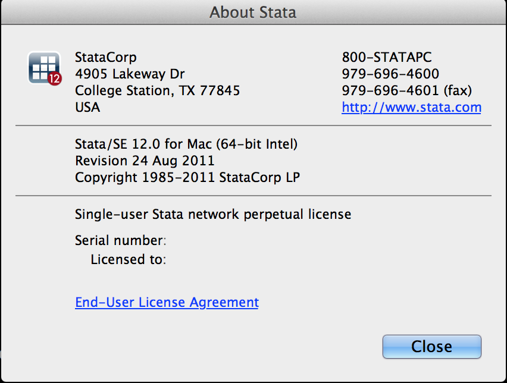

# Recitation 3: Get help 
McCourt School of Public Policy, Georgetown University


## Key Ideas:
 - Help files
 - Minimal reproducible example

## Often the fastest answer is the one you find yourself

- It's important to try to answer your own questions first
- If the answer to your question is in the help file or the top hit on Google, the answer to your question will be, "Read the documentation" or ["Google it"](http://bit.ly/YcP0TF)

## Help Files:

- We have used several complicated commands with options and if statements.
- You do not have to memorize these commands.
- Every command has a help page to tell you how to use it.
```
help count
```

* Overview of help page, including `Also See`
* Explain syntax elements relevant to count command:
	* **bold** - type as is
	* ***italics*** - replace with your own variables or expression
	* [brackets] - optional
	* underline - shortest abbreviation
	* blue - hyperlinks

* Use `Also See` to go to help page for tabulate oneway
* Explain new syntax elements: varname, options (skip `weights`)
* For more in depth description and examples, go to manual entry with `Also See`

* Look at another help page: tabstat
```
help tabstat
```
* Explain varname vs. varlist
* Go through examples on tabstat help page

* Most help pages are easy to find by guessing the command name and `See Also`
* But there are a few that are worth remembering:

	1. help contents_should_know
 	2. help language
 	3. help operators
* If you forget these, they can all be found within a few clicks using menus:

    Help     Contents     Basics     ...


## Minimal reproducible example

### Why?
>My stata prompted error when I try to count the missing values.

When you ask other people for help, you’ll get the most useful advice if you know how to make a *minimal reproducible example*. A reproducible example is a sample of code and data that any other user can run and get the same results as you do. A minimal reproducible example is the smallest possible example that illustrates the problem.

### Four parts of minimal reproducible example
A minimal reproducible example consists of the following items :
- A minimal dataset, necessary to reproduce the error
- The minimal (runnable) code necessary to reproduce the error, which can be run on the given dataset.
- The necessary information on the STATA version and system it is run on.
- In case of random processes, a seed (set by `set seed`) for reproducibility

### Example
#### Provide a minimal dataset
- Use example data set in STATA
```
sysuse auto
```
- Use a subset of data you are using. For example, draw a 10% sample from your data
```
sysuse auto, clear
sample 10
```

#### Provide minimal (runnable) code
```
* (WRONG)
sysuse auto, clear
count if rep78=.
```

#### STATA version and system
- Click `About Stata ...`


#### Set seed
- Everyone can get reproducible result by setting seed.
```
dis rnormal(2,1)
dis rnormal(2,1)

set seed 123
dis rnormal(2,1)
* 4.0861899
```
