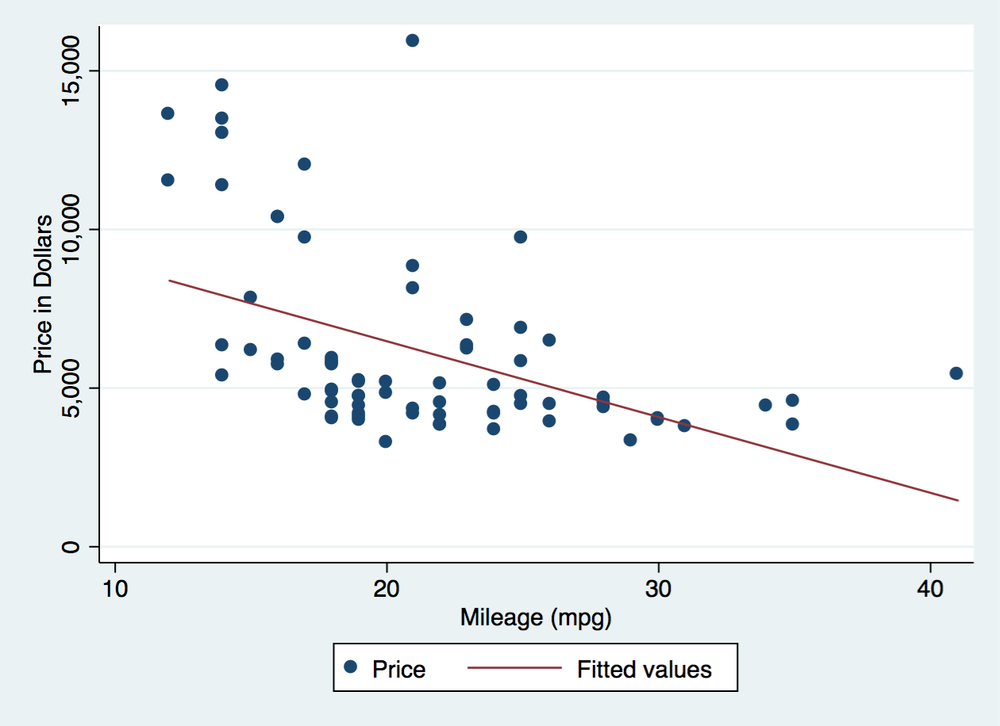

# Stata Recitation - Week 4 - Graphs
McCourt School of Public Policy, Georgetown University

## CONTENTS:
 - Graph Intro
 - Graph dialogue box
 - Graph commands
 - Graph editor window
 - Save/Export graphs


## GOALS:
 - Create graphs using graph dialogue window
 - Edit graphs using graph editor
 - Find graph examples in `graph intro` in help file and manual
 - Find examples for individual commands in manual
 - Save and export a graph


## Drawing Graphs
### Basic graphs from the twoway family 


* Example from Definition section of help graph_twoway:

```
help graph twoway
sysuse uslifeexp2
list in 1/8
twoway scatter le year
twoway line le year
twoway connected le year
twoway (scatter le year) (lfit le year)
```

* Create these graphs using graph dialogue box 
  * from drop-down menu: `Graphics>Twoway Graph (Scatter Line, etc.)`

* Now we have a generic, blank graph. We have to fill it in with plots.
  * Select `Create` to create a new plot:
      - `Basic plots > Scatter` for twoway scatter of selected Y and X variables.
      - `Basic plots > Line` for twoway line graph.
      - `Basic plots > Connected` for twoway datapoints and line graph.
      - `Fit plots > Linear prediction` for graph of line that best `fits` the data. Shows best guess for linear trend/relationship between Y and X variables.

  * When there is just one plot, we use the terms `plot` and `graph` interchangeably. 
  * But we can also overlay multiple plots within the same graph.
  	* `graph` is the entire window
	* `plot` is an individual series of data
  
  * Modify or disable individual plots by selecting it and clicking `edit`
    * Change the set of observations for that plot only using the (if/in) tab
  * Modify the overall graph using the tabs on the top of the main graph window
    * Change the set of observations for that overall graph (all plots) using the (if/in) tab
    - The layout and title of the axes (Y axis/X axis)
    - Title, Legend, etc.
  * To clear all graphs and labels hit the reset button in the lower left of the graph dialogue window, small button with a `R` icon.
       

* Can keep adding options to graph dialogue box until you have a long command like this:
```
twoway (scatter le year) (lfit le year), ytitle(Life Expectancy (Years)) ///
title (Life Expectancy by Year) subtitle(with linear fit line) ///
legend(order(1 `Actual` 2 `Fitted`))
```
     * Note: When you change the `Legend` options in the graph dialogue window, 
         use the [?] icon to get help on how to specify labels 
          * Keep adding options and submitting, and note how the command changes
         
* When submitting graphs through the dialogue window, the commands are printed out in results window. 
   * You can copy these from results back into the command line & make tweaks to the graph 
   by changing the text until you get what you want and are familiar with 
   how to specify different options for the graph such as axes titles, etc.
      - Make sure you keep the ordering of your variable names consistent when
        entering commands that overlay multiple graphs as switching the order
        will change the Y and X axes.

```
twoway (scatter y-var_name x-var_name) (lfit y-var_name x-var_name)
```
   

```
[INCORRECT]
twoway (scatter y-var_name x-var_name) (lfit x-var_name y-var_name)      
```

* When your command is complete, save the final version in a do-file.
* Commands can also be copied to clipboard using copy icon on graph dialogue box.


## Graph Editor 

* Another way to modify graphs, titles, etc., is with the graph editor
* Right click on graph and select `open graph editor`
* But, changes that you make here are not saved in a command.
* If the data changes, or you have to remake this graph, you will have to re-do any changes you made in the graph editor.
* Better to use options to get your graph as complete as possible, then make final changes using graph editor.


## Saving and Exporting Graphs 

* In graph window, can save graph using `File > Save`, save final graph as .gph file type.
      * The `.gph` file type is Stata specific and can be opened by the program and modified again later.
          * However, it is not compatible with other programs, so you will either have to copy and paste each graph one-by-one (right-click and select copy to copy it) into other programs or use the export
            function.

* In graph window, select, `file>Save` to save as file type .gph for future use or editing within Stata. 
* Select `File > Save as` to export for use with other programs
  * The graph file types you are likely to use are: emf, pdf, png
  * File type depends on how you will be using it.
    * Mac cannot generate .emf files (or .wmf)

* Saving and exporting graphs can also be done from the do-file or command line

* To save graphs in .gph format, for future editing within Stata:
```
help graph save 
graph save ".../MyNewGraph", replace
```

* To save in different format for inclusion in problem set or paper: 
```
help graph export
graph export ".../MyNewGraph", as(pdf) replace
```
* Note, if writing the command yourself, do not put a .suffix on your new graph name. 
  * Stata will automatically add the correct .suffix.

* Like the graph editor, it is easiest to run these commands from the drop-down menu, then copy them to your do-file. 
	* Add the replace option, so the file will be updated if you re-run the do-file.

### In Class Activity 1 

- Try reproduce the output with `auto.dta` from the Stata example datasets. 
- Record the commands to a do-file with proper comments.
- Save graph as a new pdf file.
- You can use either command line or graphic dialog window.




```
sysuse auto.dta
* 1. Create a scatterplot with mpg on the x axis and price on the y axis.
twoway scatter price mpg
* 2. Add a linear prediction fit line on the graph.
twoway (scatter price mpg) (lfit price mpg)
* 3. Title the y axis "Price in Dollars"
twoway (scatter price mpg) (lfit price mpg), ytitle(Price in Dollars)
* 4. Save graph as a new pdf file 
graph export "...\MyNewGraph", as(pdf) replace
```

## Other Types of Graphs

help graph intro
* Also see > Manual
* Show examples of other graphs from the manual entry
* This gives an idea of the types of graphs that are available
* You can find detailed information on specific graphs using [Visual overview for creating graphs](http://www.stata.com/support/faqs/graphics/gph/stata-graphs/) or by looking through the pdf manuals' bookmarks


### Bar Graphs
```
help graph bar
```
* Major distinction from `scatter` (from help file's `Description` section):
	- Scatter plots actual values of x and y variables
   - Bar displays calculated statistics of y-variable over x-variable categories.

* Bar graphs are conceptually similar to tabstat command that we used last week.
* From after class exercises last week:
```
sysuse census.dta
tabstat medage, by(region)
graph bar medage, over(region)
```

* Other example bar graphs are in the `Remarks - Introduction` section of `help graph bar` file.

* `Remarks - Examples of Syntax` section of `help graph bar` file shows you how to enter the commands.

* Can also experiment using graph dialogue window: 
   (from the drop-down menu: `Graphics>Bar Chart`)


### Distributional Plots 
 * Single variable graphs showing its distribution


#### Histogram 

* Histogram is the most common distributional graph
```
help histogram
```

* example 1, from the `Remarks > Histograms of continuous variables` section of help file:
```
sysuse sp500
histogram volume
```
    
- Stata automatically determines the number of bars or `bins` approriate to show the distribution of your variable.

* example 2, from the `Remarks > Histograms of discrete variables` section of help file:
```
sysuse auto
histogram mpg, discrete
```
  

- the `, discrete` option forces stata to show each distinct value of the variable in a separate bar/bin. Useful for categorical variables or numeric variables that can only take on a certain, relatively limited number of values, i.e. years of education.

* Can also experiment using graph dialogue window: 
   (from the drop-down menu: `Graphics>Histogram`)

### Exercise II 

- Use `auto.dta` from the Stata example datasets.
- Paste commands into a do-file if you are using the graph dialogue window 
- Save all graphs as `.png` format

1. Create a bar graph that shows the mean gear ratio for foreign and domestic cars.
2. Change the color of the bars to your favorite color.
3. Create a graph of your choice using the `auto.dta`.


```
sysuse auto
graph bar gear_ratio, over(foreign)
graph bar (mean) gear_ratio, over(foreign) bar(1, fcolor(black))
```

Or, 
- right-click on graph and select `start graph editor`
- Then right-click on a bar and select `Rectangle Properties` to change the color of both bars.
- Or right-click on a bar and select `Object Specific Properties` to change the color of that specific bar.
       
#### Kernel Density (For Reference)
* A smoothed version of histogram
* Creates a line, rather than a series of rectangles
* Can be used as an option to histogram
```
sysuse sp500
histogram volume , kdensity
```
  

* Or as a stand-alone command
```
kdensity volume
```
  

### Diagnostic Plots (For Reference)
```
help diagnostic plots
```
* Compares the distribution of a variable to some known distribution.
* Some quant professors will use these commands in class, but the 
* concepts have not been covered yet.
* Students should know how to find documentation on these commands, but do not 
* need to know how to interpret them. 
* Show extended examples in manual page.


       
