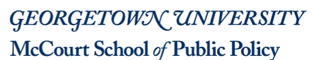

MSPP STATA Recitation for Quant 1
==========

Recitation is designed to give you the opportunity to learn and use the statistical software package, Stata. This class is designed to supplement the work you do in Statistical Methods for Policy Analysis and ultimately prepare you for the client-based or thesis capstone.

# Attendance:

Attendance is kept through an online sign-in sheet each week. Please sign-in before you leave and check that you have attended. A sample sign-in sheet can be found [here](goo.gl/e7pRXO). Each professor uses attendance information differently, so I cannot tell you the consequences of missing a class (besides the fact that we will miss you!). Due to availability of space, it is important that you attend the recitation section that you are assigned. If circumstances prevent you from attending your section, please email your correponding TA first before attending a different section.
    
# Obtaining Stata:

I strongly recommend that you go to the UIS Service Desk in St. Mary’s Hall to obtain a copy of Stata 13 for your personal computer. You can download the software from http://georgetown.onthehub.com/ but you must visit the desk in person to obtain a license. 

# Additional Help:

While I hope that you learn a lot this class, much of your proficiency in Stata will come from trial-and-error as you tackle problems sets and use the software in your workplace or internship. The following resources can be particularly helpful:

ULCA’s Institute For Digital Research and Education: http://www.ats.ucla.edu/stat/stata/
Stata Youtube Channel: http://www.youtube.com/user/statacorp
UNC Population Center: http://www.cpc.unc.edu/research/tools/data_analysis/statatutorial/

